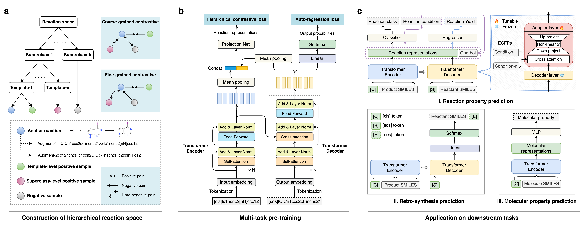

# HiCLR
Implementation of HiCLR: a knowledge-induced hierarchical contrastive learning framework on chemical reactions.


<p align="center">
 
</p>

## **Contents**

- [System Dependencies](#system-dependencies)
- [Installation Guide](#installation-guide)
- [Download resources](#download-resources)
- [Pre-train HiCLR](#pre-train-hiclr)
- [Use HiCLR](#use-hiclr)
    - [Feature extraction](#feature-extraction)
    - [Fine-tuning](#fine-tuning)


## **System Dependencies**
We implemented all experiments in a Linux platform with cuda 11.3.
* python (version >= 3.7) 
* pytorch (version >= 1.12.0) 
* rdkit (version == 2023.3.2)
* transformers (version == 4.30.2)
* rxn-opennmt-py (version == 1.1.4)
* scikit-learn (version == 0.23.1)

## **Installation Guide**
Setup the required environment using `environment.yml` with Anaconda. While in the project directory run:

    conda env create -f environment.yml

Activate the environment

    conda activate hiclr

## **Download resources**

To download the datasets and checkpoints: https://zenodo.org/records/11169946.

Unzip the data.zip and put it in the `HiCLR/data` directory.

Unzip the checkpoint.zip and put it in the `HiCLR/checkpoint` directory.

You can use the `data/random_10000.csv` as the demo data to run our code.

## **Pre-train HiCLR**

You can directly use the pre-trained model we provided in the checkpoint folder for downstream applications.

You also can use the following script to pre-train a new model:

```
bash scripts/pretrain.sh
```
Multiple hyperparameters can be selected in `args_parse.py`.

The trained model parameters and log.txt will automatically saved in the `checkpoints` directory.

## **Use HiCLR**

### Feature extraction

After pre-training, you can extract reaction fingerprints for any reaction dataset you are intrested in:
```
python extract_rxn_fps.py 
```
Please change the `data_dir` and `dataset_name` variables to your customized path.

The dataset should has a `reactants>reagents>production` column, and the extracted finginprints will be saved in the `npz` file format.

### Fine-tuning

You can fine-tune the pre-trained model on a variety of reaction-related and molecule-related tasks.


#### 1. Single-step retrosynthesis
```
[1] Train
bash scripts/finetune_retro.sh

[2] Inference
python predict_retro.py 
```

#### 2. Reaction classification
```
[1] For frozen-encoder setting
python finetune_rxnclass_cls.py --ft_mode none

[2] For full fine-tuning
python finetune_rxnclass_cls.py --ft_mode full

[3] For adapter-tuning
python finetune_rxnclass_cls.py --ft_mode adapter --ffn_mode adapter --ffn_option sequential --attn_mode adapter

```
The fine-tuning strategy can be selected in other tasks in the same way.

#### 3. Reaction yield prediction
```
[1] For classification tasks:

python finetune_yield_cls.py 

[2] For regression tasks:

python finetune_yield_reg.py 
```

#### 4. Reaction condition recommendation

```
python train_rcr.py
```

#### 5. Molecular property prediction
```
[1] Create config file
python config/moleculenet/create_configs.py

[2] Training
python finetune_moleculenet.py --config ./config/moleculenet/grid_search/config_BBBP_last_layer_cls_0.001_0.001_0.3.yaml
```
finetune, init_lr, init_base_lr and dropout are tunable hyper-parameters.

